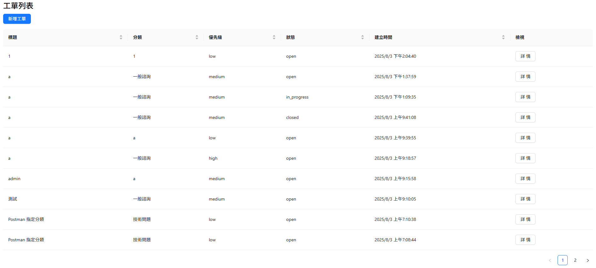

# AI 輔助工單管理系統

一個基於 Django 後端與 React 前端的智能工單管理系統，整合 Ollama AI 模型提供自動分類、優先級建議和智能回覆功能。



## ✨ 主要功能

- **智能工單分類**：利用 AI 自動分析工單內容，提供分類建議
- **優先級自動判定**：根據工單描述由AI評估優先級（低、中、高、緊急）
- **AI 輔助工單回覆**：為客服人員生成專業且友善的回覆建議
- **完整工單管理**：建立、追蹤、分配和關閉工單
- **即時快取**：使用 Redis 提升 AI 服務效能


## 🛠 技術棧

### 後端

- **Python 3.9.7** - Python 版本
- **Django 4.2.16** - Web 框架
- **Django REST Framework** - API 開發
- **Ollama** - 本地 AI 模型服務
- **Redis** - 快取系統
- **SQLite** - 預設資料庫
- **JWT** - 身份驗證


### 前端

- **React 18** - 用戶介面框架
- **Ant Design** - UI 元件庫
- **Axios** - HTTP 請求處理
- **React Router** - 路由管理


### AI 整合

- **Ollama 本地部署**
- **LLaMA 3.2:3b** - 預設語言模型
- **Redis快取機制**


## 📁 專案結構

```
ai-ticket-demo/
├── smart_helpdesk/          # Django 主要設定
│   ├── settings.py          # 專案設定檔
│   ├── urls.py             # URL 路由
│   └── wsgi.py             # WSGI 設定
├── tickets/                 # 工單應用程式
│   ├── testcases/           # 各單元測試
│   ├── models.py           # 資料模型
│   ├── services.py         # AI 服務整合
│   ├── views.py            # API 視圖
│   └── serializers.py      # 資料序列化
├── ticket-frontend/         # React 前端應用
│   ├── src/                # 原始碼
│   ├── package.json        # Dependencies
│   └── public/             # 靜態資源
├── requirements.txt         # Python 依賴
├── manage.py               # Django 管理工具
└── .env                    # 環境變數設定
```


## 🚀 快速開始

### 1. 環境準備

確保系統已安裝：

- Python 3.9+
- Node.js 22+
- npm 10+
- Docker(redis,Ollama)


### 2. 安裝 Docker 並啟動Ollama,redis image

```bash
# 啟動Ollama
docker pull ollama/ollama
docker run -d -v ollama:/root/.ollama -p 11434:11434 --name ollama ollama/ollama

# 下載模型 (選擇較小的模型以節省資源)
docker exec -it ollama ollama pull llama3.2:3b

# 啟動Redis
docker run -d --name redis -p 6379:6379 redis:latest

```


### 3. 後端設定

```bash
# 複製專案
git clone https://github.com/civic881027/ai-ticket-demo.git
cd ai-ticket-demo

# 建立虛擬環境
python -m venv venv
source venv/bin/activate  # Windows: venv\Scripts\activate

# 安裝 Python 依賴
pip install -r requirements.txt

# 設定環境變數 .env 並修改相關設定

# 資料庫遷移
python manage.py migrate

# 建立Superuser(預設一組admin,0000)
python manage.py createsuperuser

# 啟動開發伺服器
python manage.py runserver
```

## ⚙️ 環境變數設定

在 `.env` 檔案中設定以下變數：

```env
SECRET_KEY=your-very-secret-key-here
DEBUG=True
OLLAMA_HOST=http://localhost:11434
REDIS_URL=redis://localhost:6379/1
```

### 4. 前端設定

```bash
# 進入前端目錄
cd ticket-frontend

# 安裝 Node.js 依賴
npm install

# 啟動開發伺服器
npm start

# 進入網址進行測試
http://localhost:3000
```


## 🎯 主要功能模組

### 工單管理 (Ticket)

- **建立工單**：用戶可建立包含標題、描述、分類的工單
- **狀態追蹤**：開啟,處理中,已解決,已關閉
- **分配機制**：將工單分配給特定處理人員


### AI 智能服務 (OllamaService)

- **自動分類**：技術問題、帳戶問題、產品諮詢、投訴建議
- **優先級判定**：低、中、高、緊急四個等級
- **智能回覆**：生成專業客服回覆建議
- **快取優化**：避免重複 AI 計算，提升響應速度


### 用戶權限系統

- **權限管理**：基於角色的存取控制
- **JWT 認證**：安全的身份驗證機制


## 🧪 測試

```bash
#使用 pytest
pytest
```


## 📊 API 端點

主要 API 路由：

- `POST /api/token/` - 傳入帳號密碼後，取得token，以便後續操作
- `GET /api/tickets/` - 取得工單列表
- `POST /api/tickets/` - 建立新工單
- `GET /api/tickets/{id}/` - 取得特定工單
- `PUT /api/tickets/{id}/` - 更新工單
- `PATCH /api/tickets/{id}/` - 更新部分工單
- `POST /api/tickets/{id}/ai-response/` - 生成 AI 回覆

## API 所使用的Json結構

獲取access_token POST METHOD:
```bash
curl --location 'http://127.0.0.1:8000/api/token/' \
--header 'Content-Type: application/json' \
--data '{
	"username":"admin",
    "password":"0000"
  }'
```

創建工單 POST METHOD:
```bash

curl --location 'http://127.0.0.1:8000/api/tickets/' \
--header 'Content-Type: application/json' \
--header 'Authorization: Bearer {access_token}' \
--data '{
  "title": "Postman 指定分類",
  "description": "人工指定分類內容",
  "category": "test",
  "priority":"medium",
  "assigned_to":1
}'
```

獲取使用者清單:

```bash
curl --location --request GET 'http://127.0.0.1:8000/api/users/' \
--header 'Content-Type: application/json' \
--header 'Authorization: Bearer {access_token}' \

```

**注意**：此專案需要本地運行 Ollama 服務才能完整使用 AI 功能。請確保 Ollama 正確安裝並運行模型。


[^1]: https://github.com/civic881027/ai-ticket-demo/tree/main

[^2]: https://github.com/civic881027/ai-ticket-demo/tree/main

[^3]: https://github.com/civic881027/ai-ticket-demo/blob/main/requirements.txt

[^4]: https://github.com/civic881027/ai-ticket-demo/blob/main/manage.py

[^5]: https://github.com/civic881027/ai-ticket-demo/blob/main/smart_helpdesk/settings.py

[^6]: https://github.com/civic881027/ai-ticket-demo/blob/main/tickets/models.py

[^7]: https://github.com/civic881027/ai-ticket-demo/blob/main/tickets/services.py

[^8]: https://github.com/civic881027/ai-ticket-demo/blob/main/ticket-frontend/package.json

[^9]: https://github.com/civic881027/ai-ticket-demo/blob/main/.env

